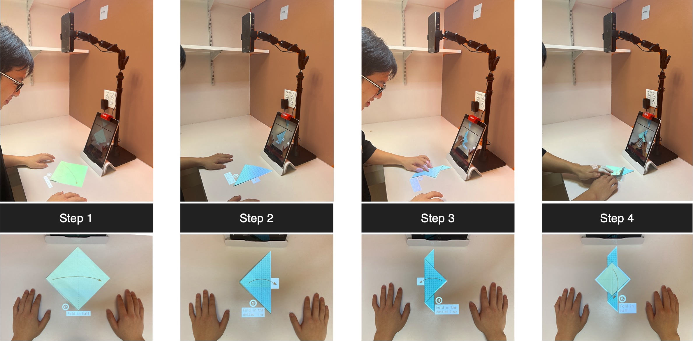

# Origami-Sensei Mixed Reality AI-Assistant iOS Application
### [ [Project Page](https://mscvprojects.ri.cmu.edu/f23team15/) |   [WiP paper](https://dl.acm.org/doi/abs/10.1145/3563703.3596625) ]

Repository for CMU MSCV Capstone project "Origami Sensei: Mixed Reality AI-Assistant for Creative Tasks Using Hands"



## System Requirements
* an iPad with iOS version 15.0
* an [akaso mini projector](https://www.akasotech.com/usermanual/wt50.pdf)
* a set of OSMO mirror and base for iPad
* Python version 3.8

## Installation
1. Create a python environment and install packges including `numpy`, `flask`, and `termcolor`
2. clone the repo to a local folder for this project
   ```bash
   cd your/own/local/folder
   git clone https://github.com/Jameschen7/Origami-Sensei.git
   cd Origami-Sensei
   ```
3. Set up the projector, the OSMO mirror, the base, and the iPad as outlined in the paper. Make sure they connect to the same Wi-Fi.
4. Go to the folder for the website backend and start runnning the backend server. 
   ```bash
   cd projection_website
   source run.sh 
   ```
5. Copy the url address (E.g. `http://192.168.1.75:5000`) from the program log message to the `url_address` variable of the swift file `Origami_Sensei_app/OrigamiSensei/VisionObjectDetectionViewController.swift`.
6. Within the file `projection_website/display.py`, change the values for `proj_half_width_mm` inside `GLOBAL_VARS` based on the measured real-world distance in millimeter of half of the width of the projected area
7. Similarly change the value for `table_mm_2_proj_px_scale` inside `GLOBAL_VARS` by 
   1. uncommenting out the `calibration-square` element in file `projection_website/templates/main.html.jinja`
   2. quit and restart the program OR press save in the python file `display.py` (to make Flask automatically restart)
   3. measure the real-world size of the 300x300px calibration-square and calculate the scale from mm to px
   4. use this scale as the value
   5. comment out the `calibration-square` element in file `projection_website/templates/main.html.jinja`
8. Quit and restart the program OR press save in the python file `display.py` (to make Flask automatically restart)
9. Build the app onto the iPad using a cord. For the first time building the App, you may need to:
   1.  Go the Setting > VPN ... and trust the App
   2.  Log into your Apple developer account in XCode
   3.  Enable camera on the iPad
10. Done! Start playing with Origami Sensei!

## :hearts: Acknowledgement
* Detection models trained using [Turi Create](https://github.com/apple/turicreate) framework
* Pseudo-ground-truth bbox annotation using [GroundingDINO](https://github.com/IDEA-Research/GroundingDINO/tree/main)
* Projection display UI font from [Inter](https://github.com/rsms/inter)
